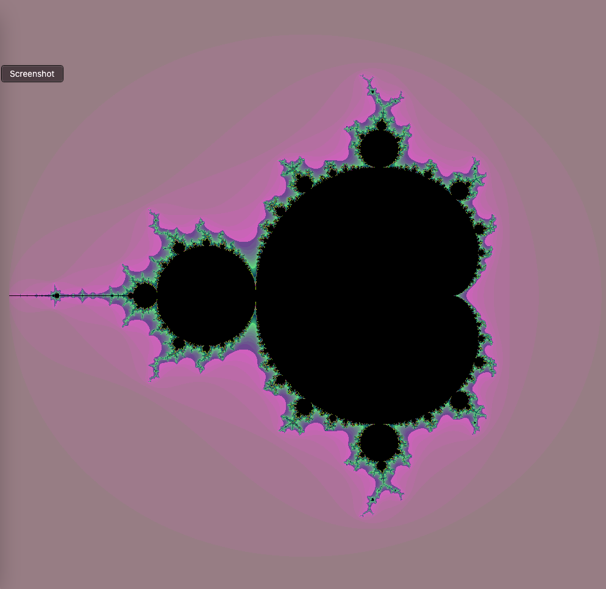
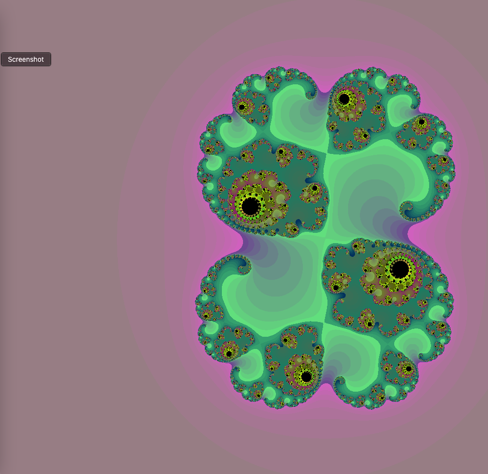
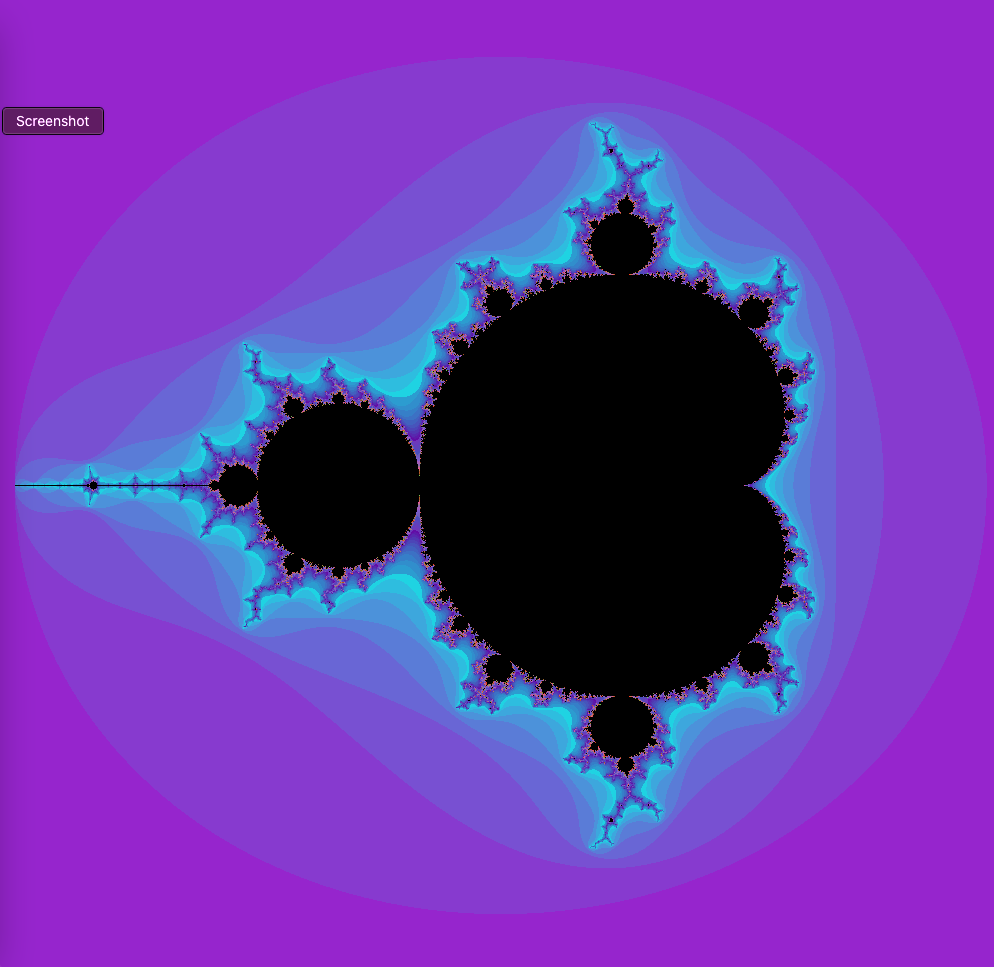
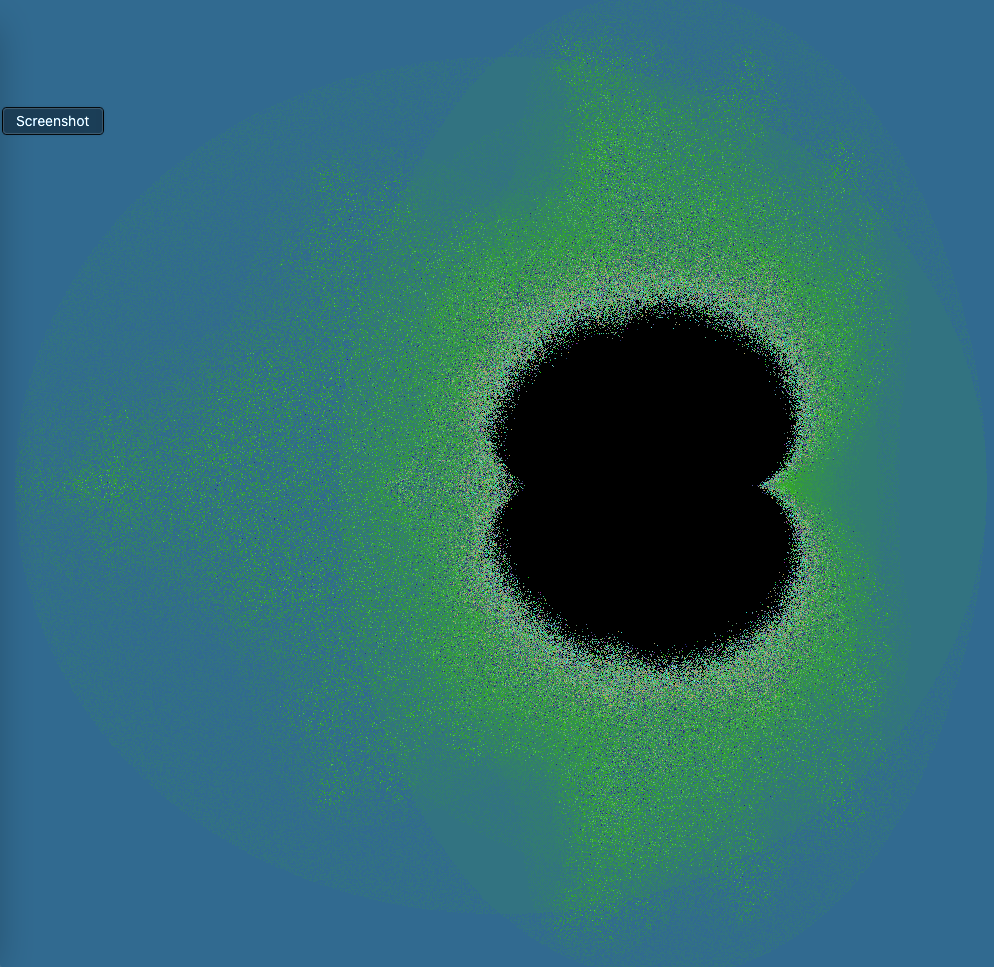
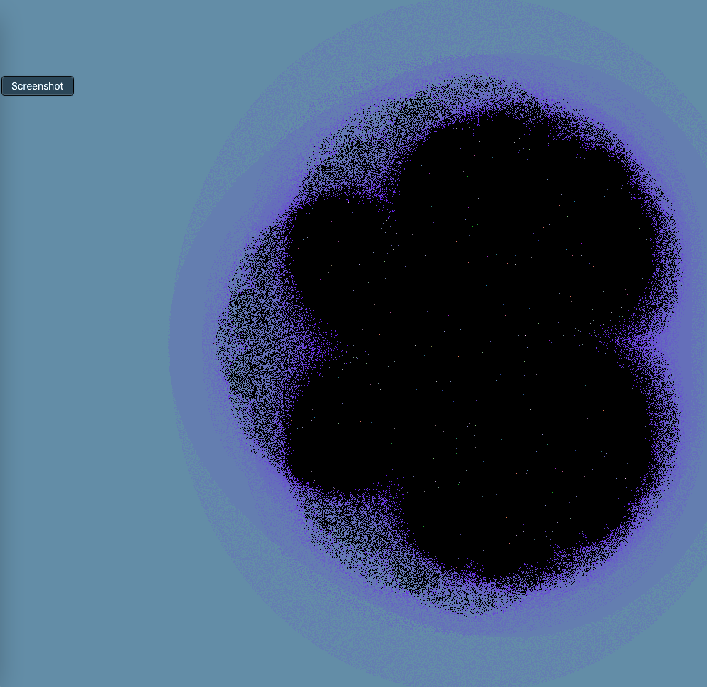

# ComplexFractalArtGenerator

# Extending classic Mandelbrot approach to create unlimited varied results

# Goal is the create various kinds of Fractal Art, Probabilistic/Non-Probabilistic

- I also plan to add the option to Probabilistic methods to create interesting art
- Personal project of re-writing but also improving a very old project with much more optimization, power, and functionality.
- The art aspect of things will be emphasized more than the theoretical sanity checks.

In order to create a generator executable from the ComplexFractalArtGenerator directory
, please use the command: javac generator/Generate.java

To run the generator after compiling
, please use the command : java generator/Generate

For custom Julia Set mode where the toAddValue parameter is customized
, please use the same command with two double values following it separated by a space:
java generator/Generate 0.285 0.01
(Tip: Pressing T key will reveal the custom Julia Set mode...)
(Tip: The results of the custom Julia Set mode is quite sensitive to change in parameters.)

Key Commands for exploration:

- WASD keys: move camera
- R key: randomize color theme
- O key: Ordinary/Default non-probabilistic art
- P key: Toggle between Probabilistic Art styles
- Up arrow key: zoom in
- Down arrow key: zoom out
- N key + Up arrow key: increase depth precision
- N key + Down arrow key: decrease depth precision
- T key: Toggle betwen Fractal.toAddOption applied or not applied
  (toAddOption fixes the added component Fractal.toAddValue to the Mandelbrot Set function)
